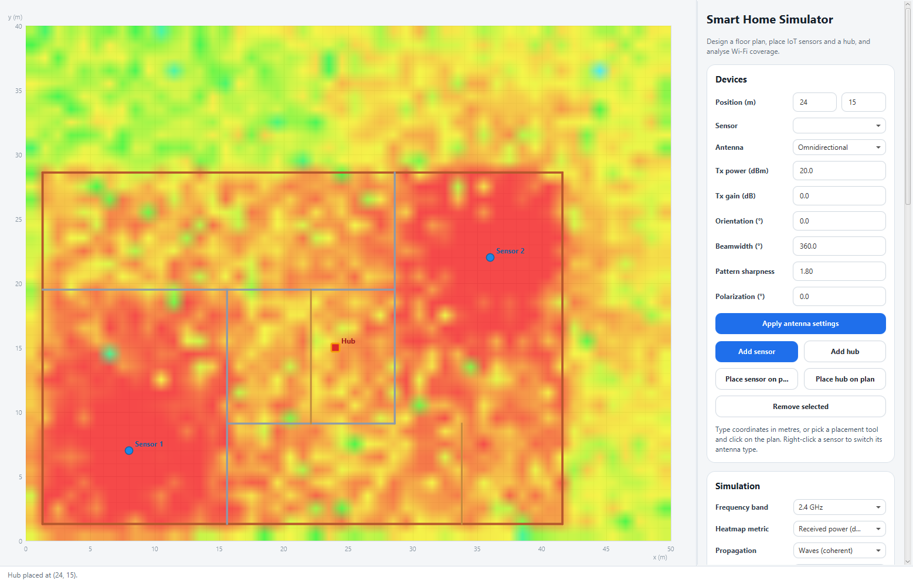
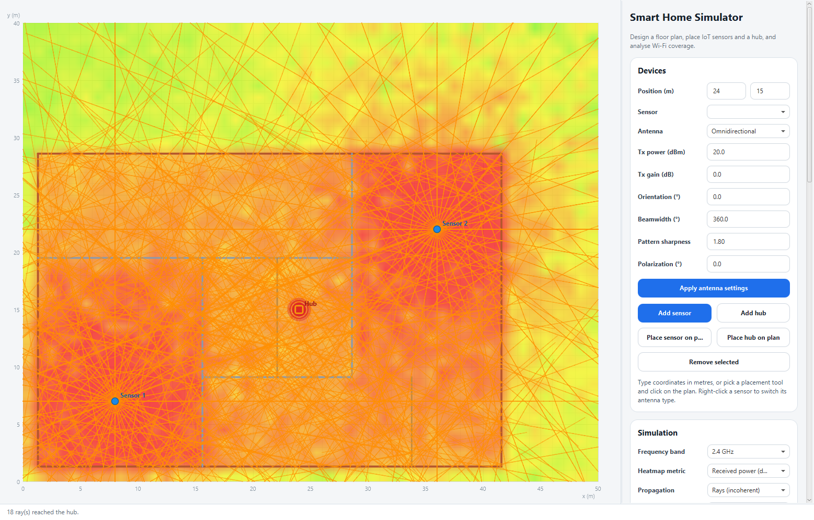
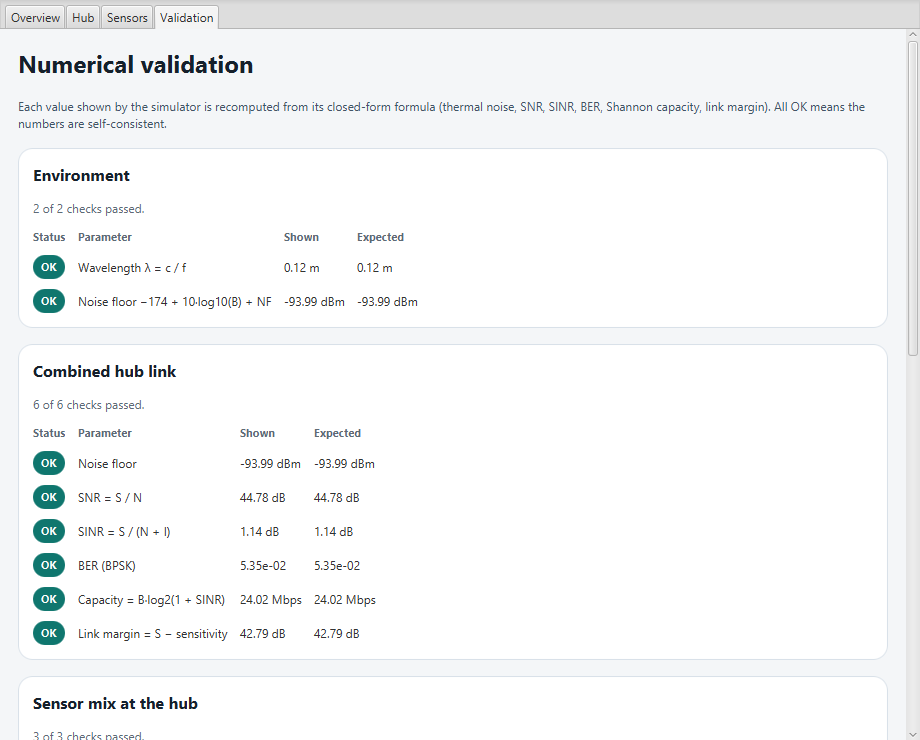
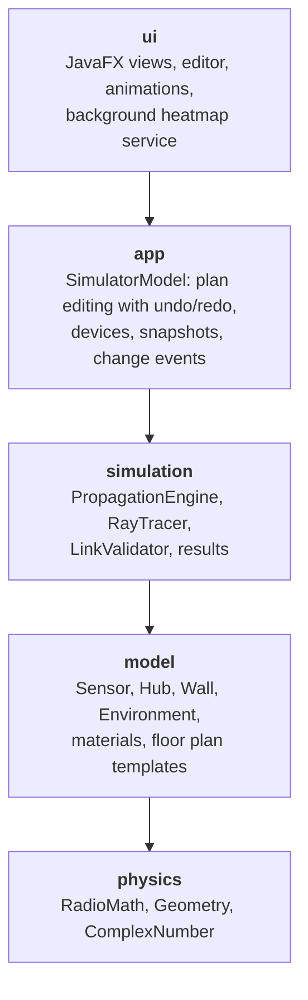

# Smart Home Simulator

[](https://github.com/Phlekies/Smart_Home_Simulator_2/actions/workflows/ci.yml)


[](LICENSE)

Desktop simulator of **indoor Wi-Fi propagation** for smart-home and IoT deployments.
Draw a floor plan, place sensors and a hub, and see how walls, materials, reflections and
interference shape the coverage — as a live heatmap, as animated ray tracing and as a
per-link budget whose every number is validated against its closed-form formula.



## Features

- **Multipath propagation engine**: direct path, specular reflections (image method),
  knife-edge diffraction (ITU-R P.526) and diffuse scattering, combined incoherently
  (*rays*) or as phasors with interference (*waves*).
- **Realistic channel**: log-distance path loss, frequency-dependent wall materials
  (drywall, brick, concrete, glass, wood, metal), Rayleigh/Rician fading, antenna
  patterns and polarization mismatch.
- **Link metrics** at every square metre: received power, SNR, SINR with multi-sensor
  interference, BPSK bit error rate, Shannon capacity and link margin.
- **Background computation** with progress and cancellation: the heatmap updates
  automatically after every edit without freezing the UI.
- **Floor plan editor**: draw walls and rooms, change materials and thickness, undo/redo,
  12 built-in templates (apartments, hotel, offices, clinic, warehouse, factory...).
- **Ray tracing animation**: rays split into transmitted and reflected branches at every
  wall and fade with the remaining power; arrivals at the hub report their link budget.
- **Numerical validation** window that recomputes every displayed metric from first
  principles.

| Ray tracing | Formula validation |
| --- | --- |
|  |  |

## Getting started

Requirements: **JDK 21 or newer**. Gradle and JavaFX are downloaded automatically by the
Gradle Wrapper.

```bash
# Windows
gradlew.bat run

# Linux / macOS
./gradlew run
```

Other useful tasks:

| Command | What it does |
| --- | --- |
| `./gradlew test` | Runs the 140+ unit, regression and architecture tests |
| `./gradlew build` | Compiles, tests, writes a coverage report and packages `build/distributions/*.zip` |
| `./gradlew jacocoTestReport` | Coverage report in `build/reports/jacoco/test/html` |

To work on the code, import the folder as a Gradle project in IntelliJ IDEA, Eclipse
(Buildship) or VS Code.

### Quick tour

1. A two-bedroom apartment is loaded at start-up. Pick another one under **Templates**.
2. Under **Devices**, press **Place sensor on plan** and click on the plan; do the same
   with **Place hub on plan**.
3. Press **Show heatmap**. Change the metric (power, SINR, BER, capacity), the band or the
   fading model and watch it refresh.
4. Hover the plan to probe any point: dominant sensor, SINR, BER and the strongest paths.
5. **Launch rays** / **Launch waves** animate the propagation; **Open simulation summary**
   shows the hub link, every sensor and the formula checks.

## The physics

For every receiver point and sensor the engine builds a set of paths and applies a link
budget to each one:

```
Pr = Pt + Gt(θ) + Gr + Gsys − PL(d) − α·d − Σ L_walls − L_reflection − L_diffraction − L_scattering − L_polarization + F
```

| Term | Model |
| --- | --- |
| `PL(d)` | Log-distance: `FSPL(1 m) + 10·n·log10(d)`, with `FSPL = 32.45 + 20·log10(f[MHz]) + 20·log10(d[km])` |
| `L_walls` | Penetration loss of every wall crossed; depends on material, band and thickness |
| `L_reflection` | Material reflection loss, weaker at grazing incidence; paths found with the image method |
| `L_diffraction` | Knife-edge loss `J(v)` at wall end points, `v = √(2·Δd/λ)` |
| `Gt(θ)` | Omnidirectional, or `cos^k` main lobe with a side-lobe floor for directional antennas |
| `L_polarization` | `−20·log10(|cos Δψ|)`, capped at 26 dB |
| `F` | Rayleigh or Rician fading, seeded by position so results are reproducible |

Paths are then combined per sensor, and sensors against each other:

| Metric | Formula |
| --- | --- |
| Noise floor | `N = −174 dBm/Hz + 10·log10(B) + NF` |
| SNR / SINR | `S / N` and `S / (N + I)`: the strongest sensor is the signal `S`, the rest add up as interference `I` |
| Bit error rate | BPSK over AWGN: `½·erfc(√SINR)` |
| Capacity | Shannon: `B·log2(1 + SINR)` |
| Link margin | `S − receiver sensitivity` |

## Architecture

The code is organised in layers that only depend downwards. The rule is enforced by an
[ArchUnit test](src/test/java/io/github/phlekies/smarthome/ArchitectureTest.java), which also
checks that JavaFX is only used by the UI, so the physics and the simulation are testable
without a display.



| Package | Responsibility |
| --- | --- |
| [`physics`](src/main/java/io/github/phlekies/smarthome/physics) | Pure formulas: path loss, noise, BER, Shannon, knife-edge, segment geometry |
| [`model`](src/main/java/io/github/phlekies/smarthome/model) | Domain objects, wall materials and the 12 floor plan templates |
| [`simulation`](src/main/java/io/github/phlekies/smarthome/simulation) | Multipath engine (parallel, cancellable), iterative ray tracer, formula validator |
| [`app`](src/main/java/io/github/phlekies/smarthome/app) | UI-independent application state with snapshot-based undo/redo |
| [`ui`](src/main/java/io/github/phlekies/smarthome/ui) | Plan view, editor, side panel sections, animations, summary window, styles in `app.css` |

## Testing

`./gradlew test` runs 144 tests (JUnit 6), executed on Linux, Windows and macOS by the CI
pipeline:

- **Physics** checked against textbook values: Friis loss, noise floor of a 20 MHz channel,
  BPSK needing ~9.6 dB for a BER of 10⁻⁵, the 6 dB knife-edge loss at grazing incidence...
- **Engine** properties: exact link budget in free space, wall losses, image-method path
  lengths, interference, culling, identical parallel and sequential results, cancellation.
- **Regression**: reference values produced by the original engine, which the refactored
  engine reproduces bit for bit.
- **Application state**: undo/redo of every edit, sequential device ids, isolated snapshots.
- **Architecture** rules with ArchUnit.

## Limitations

- 2D top-down model: no floors, ceilings or antenna heights.
- One reflection per path; wall materials use empirical average losses.
- Fading is a statistical approximation, not a full channel model.

## Project history

Started in 2025 as a Java learning project and rebuilt in 2026 into a layered, tested and
continuously integrated application.

## License

Released under the [MIT License](LICENSE).
