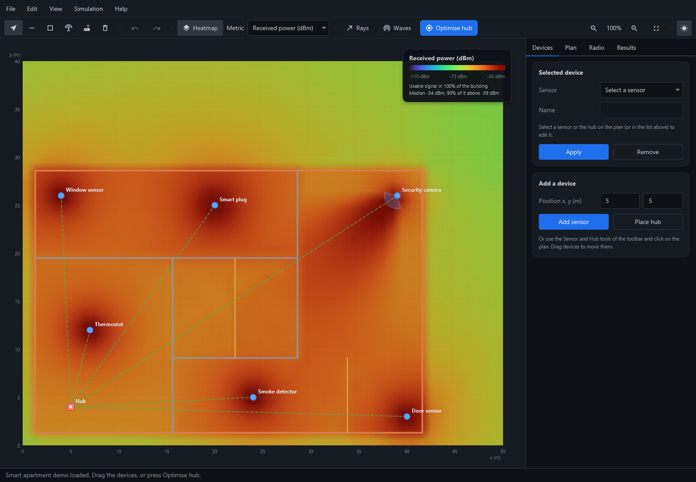
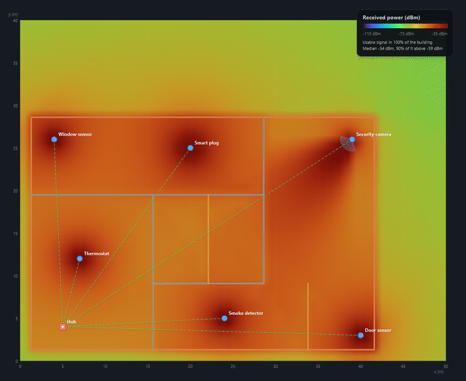
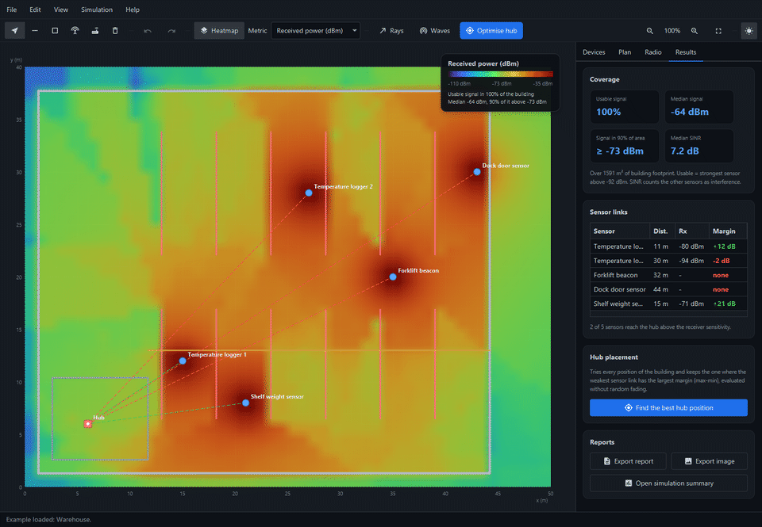
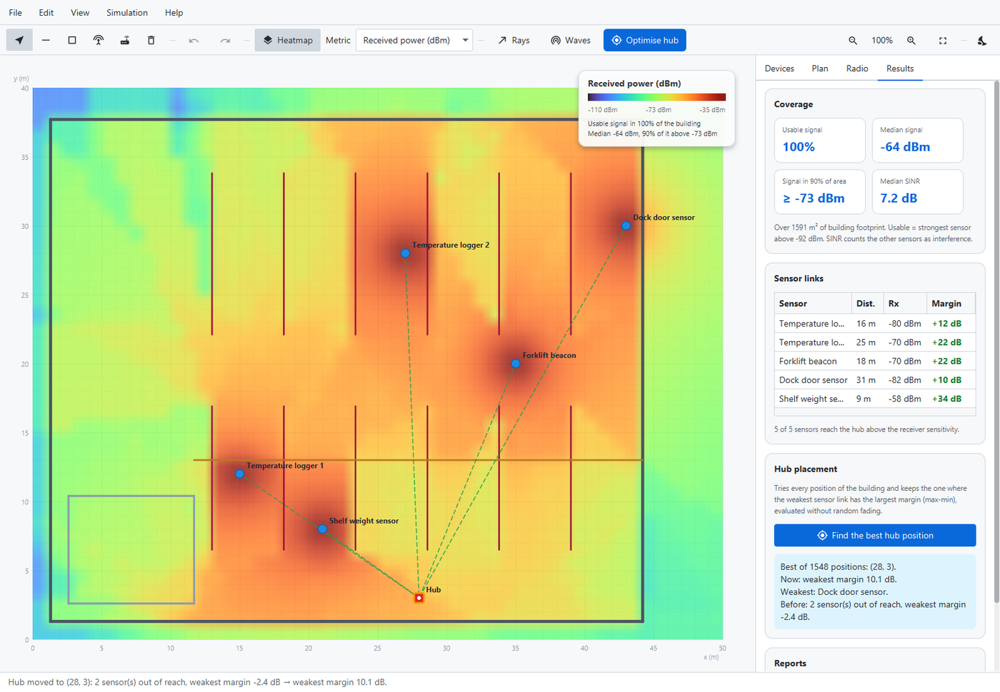
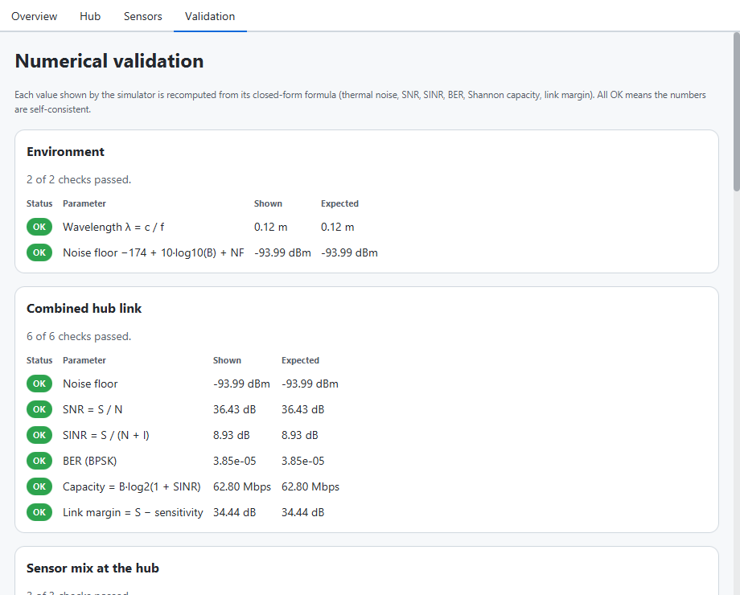
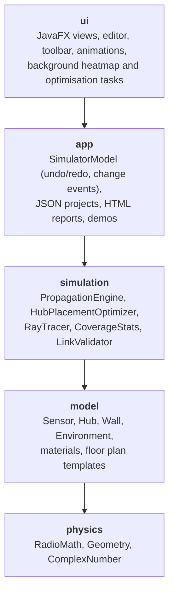

# Smart Home Simulator

[](https://github.com/Phlekies/smart-home-simulator/actions/workflows/ci.yml)


[](LICENSE)
[](https://github.com/Phlekies/smart-home-simulator/releases/latest)

Desktop simulator of **indoor wireless propagation** for smart-home and IoT deployments.
Draw a floor plan, drop sensors and a hub, and see how walls, materials, reflections and
distance shape the coverage — as a live heatmap, as animated ray tracing and as a per-link
budget. One click finds the hub position that serves every sensor best.



**[Download for Windows, macOS or Linux](https://github.com/Phlekies/smart-home-simulator/releases/latest)**
— no Java installation needed.

## Highlights

- **Multipath propagation engine**: direct path, specular reflections (image method),
  knife-edge diffraction (ITU-R P.526) and diffuse scattering, combined as average power
  (*rays*) or as phasors that interfere (*waves*). Walls attenuate according to their
  material, thickness and frequency band.
- **Live coverage heatmap** computed in the background, with a colour legend and coverage
  statistics. Drag any sensor or the hub and everything updates while you move it; zoom and
  pan around the plan.
- **Automatic hub placement**: evaluates every position of the building and picks the one
  that reaches every sensor with the largest worst-case margin (max-min optimisation).
- **Sensor links at a glance**: green/red lines and a table with received power, SNR and
  link margin of every sensor.
- **Floor plan editor**: walls, rooms, six materials, undo/redo and 12 building templates.
- **Ray tracing animation** showing how energy reflects and passes through walls.
- **Projects and reports**: save/open JSON projects, export the plan as PNG or a
  self-contained HTML coverage report.
- **Dark and light themes** (AtlantaFX), keyboard shortcuts, formula-validation window.

## See it in action

**Live editing.** Dragging the thermostat through the apartment: the heatmap, the coverage
figures in the legend and the sensor-hub links are recomputed while it moves.



**Hub placement.** In the warehouse example the hub sits in the office and the metal shelving
leaves three sensors out of range (red links). *Optimise hub* tries the 1,548 whole-metre
positions of the building and moves the hub to the one where all five sensors connect.



| Ray tracing from one sensor | Light theme |
| --- | --- |
|  |  |

The ray animation is illustrative: it shows how energy reflects and passes through walls.
The numbers (heatmap, links, optimiser) come from the propagation engine described below.

## Getting started

### Download

Ready-to-run packages are attached to every
[release](https://github.com/Phlekies/smart-home-simulator/releases/latest). Each one bundles its
own Java runtime:

| System | Package | How to run |
| --- | --- | --- |
| Windows | `SmartHomeSimulator-*-windows-x64.zip` | Unzip and run `SmartHomeSimulator.exe` |
| macOS (Apple silicon) | `SmartHomeSimulator-*-macos-arm64.dmg` | Drag the app to Applications; the first time, right-click it and choose *Open* |
| Linux (Debian/Ubuntu) | `SmartHomeSimulator-*-linux-x64.deb` | `sudo apt install ./SmartHomeSimulator-*.deb` |

### Build from source

Requirements: **JDK 21 or newer**. Gradle and every library (JavaFX included) are
downloaded automatically by the Gradle Wrapper.

```bash
# Windows
gradlew.bat run

# Linux / macOS
./gradlew run
```

The simulator opens with the smart apartment demo. Other things to try:

1. Drag a sensor or the hub on the plan and watch the heatmap, the links and the
   coverage figures update.
2. Press **Optimise hub** (Ctrl+P), or open *File → Open example → Warehouse* first.
3. Select a sensor and press **Rays** to see its reflections; **Waves** shows the
   wavefronts reaching the hub.
4. Change the heatmap metric (power, SINR, bit error rate, capacity), the band or the
   fading model and compare.
5. Draw your own walls and rooms with the toolbar tools, then *File → Export coverage
   report* for a shareable HTML report.

Example projects live in [`examples/`](examples) and can be opened with *File → Open*.

| Command | What it does |
| --- | --- |
| `./gradlew test` | Runs the unit, regression, architecture and headless UI tests |
| `./gradlew build` | Compiles, tests, writes a coverage report and packages `build/distributions/*.zip` |
| `./gradlew jpackage` | Builds a native, self-contained application for the current OS in `build/jpackage` |

### Keyboard shortcuts

| Keys | Action |
| --- | --- |
| Ctrl+N / Ctrl+O / Ctrl+S | New, open, save project |
| Ctrl+Z / Ctrl+Y | Undo / redo plan edits |
| Delete / Esc | Delete the selection / cancel drawing |
| Ctrl+H / Ctrl+L / Ctrl+T | Toggle heatmap, sensor links, dark theme |
| Ctrl+P | Optimise the hub position |
| Ctrl + mouse wheel, Ctrl+= / Ctrl+- / Ctrl+0 | Zoom in / out / fit; drag with the middle button to pan |
| Ctrl+E / Ctrl+R | Export plan image / coverage report |

## The physics

For every receiver point and sensor the engine builds a set of paths and applies a link
budget to each one:

```
Pr = Pt + Gt(θ) + Gr + Gsys − PL(d) − α·d − Σ L_walls − L_reflection − L_diffraction − L_scattering − L_polarization + F
```

| Term | Model |
| --- | --- |
| `PL(d)` | Log-distance: `FSPL(1 m) + 10·n·log10(d)`, with `FSPL = 32.45 + 20·log10(f[MHz]) + 20·log10(d[km])` |
| `L_walls` | Penetration loss of every wall crossed; depends on material, band and thickness |
| `L_reflection` | Material reflection loss, weaker at grazing incidence; paths found with the image method |
| `L_diffraction` | Knife-edge loss `J(v)` at wall end points, `v = √(2·Δd/λ)` |
| `Gt(θ)` | Omnidirectional, or `cos^k` main lobe with a side-lobe floor for directional antennas |
| `L_polarization` | `−20·log10(|cos Δψ|)`, capped at 26 dB |
| `F` | Optional Rayleigh or Rician fading, seeded by position so results are reproducible |

| Metric | Formula |
| --- | --- |
| Noise floor | `N = −174 dBm/Hz + 10·log10(B) + NF` |
| SNR / SINR | `S / N` and `S / (N + I)`: the strongest sensor is the signal `S`, the rest add up as interference `I` |
| Bit error rate | BPSK over AWGN: `½·erfc(√SINR)` |
| Capacity | Shannon: `B·log2(1 + SINR)` |
| Link margin | `S − receiver sensitivity` |

**Hub placement.** Each candidate position is scored by evaluating every sensor's link on
its own (sensors share the channel in turns, so they do not interfere with their own
uplink). Candidates are ranked by the number of unreachable sensors, then by the worst link
margin, then by the mean margin. Fading is disabled during the search so the choice
reflects the average channel.

**Validation.** The simulation summary recomputes every displayed metric from its
closed-form formula, so the numbers shown in the UI are checked for self-consistency.



## Architecture

The code is organised in layers that only depend downwards. The rule is enforced by an
[ArchUnit test](src/test/java/io/github/phlekies/smarthome/ArchitectureTest.java), which also
checks that JavaFX is only used by the UI, so everything below it is testable headless.



| Package | Responsibility |
| --- | --- |
| [`physics`](src/main/java/io/github/phlekies/smarthome/physics) | Pure formulas: path loss, noise, BER, Shannon, knife-edge, segment geometry |
| [`model`](src/main/java/io/github/phlekies/smarthome/model) | Domain objects, wall materials and the 12 floor plan templates |
| [`simulation`](src/main/java/io/github/phlekies/smarthome/simulation) | Parallel, cancellable multipath engine; hub optimiser; iterative ray tracer; coverage statistics; formula validator |
| [`app`](src/main/java/io/github/phlekies/smarthome/app) | UI-independent application state with snapshot-based undo/redo, project files (Jackson), HTML report |
| [`ui`](src/main/java/io/github/phlekies/smarthome/ui) | Plan view, editor, toolbar, side panel tabs, animators, dialogs; styles in `app.css` on top of AtlantaFX |

## Testing

`./gradlew test` runs 192 tests (JUnit 6), executed on Linux, Windows and macOS by the CI
pipeline, with 93–100 % line coverage of the non-UI layers and 81 % overall:

- **Physics** checked against textbook values: Friis loss, noise floor of a 20 MHz channel,
  BPSK needing ~9.6 dB for a BER of 10⁻⁵, the 6 dB knife-edge loss at grazing incidence...
- **Engine** properties: exact free-space link budget, wall losses, image-method path
  lengths, interference, culling, identical parallel and sequential results, cancellation.
- **Regression**: reference values produced by the original engine before the refactoring.
- **Hub optimiser**: symmetric layouts put the hub half way, reachability dominates margin,
  every candidate is scored, cancellation.
- **Projects and reports**: JSON round trips, invalid and newer files rejected, the example
  projects load, HTML output is escaped.
- **Application state**: undo/redo of every edit, device moves, isolated snapshots.
- **User interface**: smoke tests start the real application on the headless Monocle platform
  and drag a sensor, draw and undo a wall, optimise the hub, zoom, switch theme and export.
- **Architecture** rules with ArchUnit.

## Limitations

- 2D top-down model: no floors, ceilings or antenna heights.
- One reflection per path; wall materials use empirical average losses.
- Fading is a statistical approximation, not a full channel model.

## Project history

Started in 2025 as a Java learning project and rebuilt in 2026 into a layered, tested and
continuously integrated application. See the [changelog](CHANGELOG.md) for the details, and
[CONTRIBUTING.md](CONTRIBUTING.md) to build, test or propose changes.

## License

Released under the [MIT License](LICENSE).
